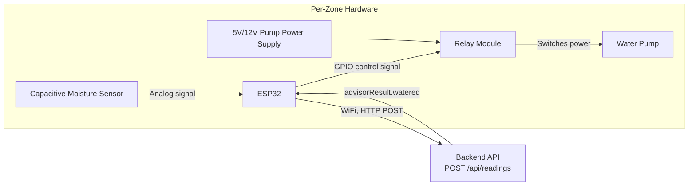

# Hardware Integration Guide

This document is written for whoever physically builds the sensor deployment — the current implementation runs entirely on a software simulator (`backend/src/simulator/sensorSimulator.js`), and this guide is the path from that simulator to real hardware in the ground. It assumes no prior context beyond basic electronics.

**What I could not do**: I cannot compile, flash, or test physical firmware — there's no Arduino/ESP32 toolchain or physical hardware in this environment. The firmware below is written to match this project's actual API contract and the sensor's documented electrical behavior, but **it must be compiled and verified on real hardware before trusting it**, the same way any first firmware draft would be.

---

## 1. Bill of Materials

| Component | Spec | Qty (per zone) | Notes |
|---|---|---|---|
| Microcontroller | **ESP32 DevKit v1** (or similar, e.g. ESP32-WROOM-32) | 1 per zone, or 1 shared unit multiplexing several probes | Chosen over Arduino Uno because it has built-in WiFi — required to POST to this project's REST API without extra bridge hardware. 12-bit ADC (0–4095). |
| Soil moisture sensor | Capacitive soil moisture sensor v1.2/v2.0 | 1 per zone | Capacitive, not resistive — the exposed-probe resistive style (LM393 two-probe module) corrodes in soil within weeks; capacitive sensors don't have exposed conductors and last far longer. This is the single highest-value hardware decision in this build. |
| Relay module | 1-channel 5V relay module (opto-isolated) | 1 per zone | Drives the pump. Most cheap modules are **active-LOW** (a LOW signal energizes the relay) — verify yours before wiring; get this backwards and the pump runs constantly instead of on command. |
| Water pump | Small submersible 5V/12V DC pump, or a 12V solenoid valve if on mains water pressure | 1 per zone | Match pump voltage to your available power supply; the relay module just needs to be rated for the pump's current draw. |
| Power supply | 5V/2A USB supply per ESP32; separate supply for the pump matching its voltage | 1 each | Do not power the pump from the ESP32's 5V pin — pumps draw far more current than the board can safely supply. |
| Misc | Jumper wires, breadboard or perfboard, waterproof enclosure for the electronics, silicone/epoxy to weatherproof exposed sensor wiring joints | — | The enclosure matters more than it sounds — this is going in a garden bed, and a single rain event on an unprotected ESP32 ends the deployment. |

**Budget note**: at the time of writing, a capacitive sensor + ESP32 + relay + small pump typically runs $15–25 per zone in component cost (varies heavily by region/supplier) — fill in your actual sourcing costs in the IETP proposal's budget section once you've picked suppliers.

---

## 2. Wiring



**Sensor → ESP32:**
- Sensor VCC → ESP32 3.3V (most capacitive sensors run fine at 3.3V; check your specific module's datasheet — running a 5V-only sensor at 3.3V under-reads, and feeding a 5V sensor output into an ESP32 ADC pin risks damaging it)
- Sensor GND → ESP32 GND
- Sensor analog output (AOUT) → an **ADC1** pin (GPIO32–39). Avoid ADC2 pins (GPIO0, 2, 4, 12–15, 25–27) — they conflict with WiFi and give unreliable readings whenever the radio is active, which is most of the time in this project.

**ESP32 → Relay → Pump:**
- Relay VCC → ESP32 5V (relay coils typically need 5V even on 3.3V logic boards — check your module)
- Relay GND → ESP32 GND
- Relay IN → any free GPIO (e.g. GPIO26)
- Relay COM/NO → in series with the pump's power line from its own supply (not the ESP32's supply)

**Power-gating the sensor (recommended, not optional for a real deployment):** wire the sensor's VCC through a spare GPIO instead of a permanent power rail, so firmware only energizes the sensor for the ~50ms it takes to read it, then powers it off. Continuously-powered capacitive sensors still degrade faster than power-gated ones, and this also cuts the ESP32's power draw meaningfully if it's on battery/solar. This is a small firmware change (see below) for a real reliability gain.

---

## 3. Calibration (do this before trusting any reading)

Every sensor unit reads differently even for identical soil — this is why `sensorCalibration.js` treats calibration as per-zone data, not a shared constant. Calibrate **each physical sensor** you deploy:

1. Flash the firmware below with `DEBUG_MODE` enabled (prints raw ADC values to Serial without posting anywhere yet).
2. Submerge the probe fully in a glass of water. Wait 10 seconds for the reading to settle. Record this as **`wetRaw`**.
3. Dry the probe completely (paper towel, then air-dry for a few minutes). Record this as **`dryRaw`**.
4. Enter both values into the firmware's `CALIBRATION` struct for that specific device.
5. Re-check every few months — capacitive sensors drift slowly with age; recalibrating is cheap insurance against silently wrong readings.

Expect `wetRaw` roughly in the 1100–1400 range and `dryRaw` roughly in the 2800–3200 range on a 12-bit ESP32 ADC, but **use your own measured values, not these** — this is exactly the variance calibration exists to correct for.

---

## 4. Firmware Reference (ESP32, Arduino framework)

This mirrors the project's simulator logic exactly (raw ADC → calibrated percentage → POST → act on the response), so switching from the software simulator to this firmware requires no backend changes.

```cpp
#include <WiFi.h>
#include <HTTPClient.h>
#include <ArduinoJson.h>

// ---- Configuration: fill these in for your deployment ----
const char* WIFI_SSID = "YOUR_WIFI_SSID";
const char* WIFI_PASSWORD = "YOUR_WIFI_PASSWORD";
const char* API_URL = "http://YOUR_BACKEND_HOST:5001/api/readings";
const int ZONE_ID = 1; // must match this zone's id in the garden_zones table

// ---- Calibration: set from the procedure in Section 3 above ----
const int WET_RAW = 1200;  // <-- replace with YOUR measured value
const int DRY_RAW = 3000;  // <-- replace with YOUR measured value

// ---- Pins ----
const int SENSOR_POWER_PIN = 27; // power-gates the sensor VCC (see Section 2)
const int SENSOR_ADC_PIN = 34;   // ADC1 pin
const int RELAY_PIN = 26;

// ---- Timing ----
const unsigned long READ_INTERVAL_MS = 10UL * 60UL * 1000UL; // 10 minutes between readings
const unsigned long PUMP_PULSE_MS = 5000UL;                   // 5 second pump pulse when watering
const bool RELAY_ACTIVE_LOW = true; // most cheap relay modules are active-LOW — verify yours

void relayWrite(bool energize) {
  digitalWrite(RELAY_PIN, (energize == RELAY_ACTIVE_LOW) ? LOW : HIGH);
}

void setup() {
  Serial.begin(115200);

  pinMode(SENSOR_POWER_PIN, OUTPUT);
  digitalWrite(SENSOR_POWER_PIN, LOW); // sensor off until we read it
  pinMode(RELAY_PIN, OUTPUT);
  relayWrite(false); // pump off at boot

  WiFi.begin(WIFI_SSID, WIFI_PASSWORD);
  Serial.print("Connecting to WiFi");
  while (WiFi.status() != WL_CONNECTED) {
    delay(500);
    Serial.print(".");
  }
  Serial.println(" connected.");
}

// Same mapping as backend/src/simulator/sensorCalibration.js's rawToPercent(),
// so simulated and real readings behave identically once swapped in.
float rawToPercent(int raw) {
  int clamped = constrain(raw, WET_RAW, DRY_RAW);
  float percent = ((float)(DRY_RAW - clamped) / (float)(DRY_RAW - WET_RAW)) * 100.0;
  return constrain(percent, 0.0, 100.0);
}

int readCalibratedRaw() {
  digitalWrite(SENSOR_POWER_PIN, HIGH);
  delay(50); // let the sensor settle after power-on before reading
  int raw = analogRead(SENSOR_ADC_PIN);
  digitalWrite(SENSOR_POWER_PIN, LOW); // power back off immediately — see Section 2
  return raw;
}

void loop() {
  int raw = readCalibratedRaw();
  float moisturePercent = rawToPercent(raw);

  Serial.print("Raw: ");
  Serial.print(raw);
  Serial.print(" -> Moisture: ");
  Serial.print(moisturePercent);
  Serial.println("%");

  if (WiFi.status() == WL_CONNECTED) {
    HTTPClient http;
    http.begin(API_URL);
    http.addHeader("Content-Type", "application/json");

    StaticJsonDocument<128> requestDoc;
    requestDoc["zoneId"] = ZONE_ID;
    requestDoc["moisturePercent"] = moisturePercent;
    String requestBody;
    serializeJson(requestDoc, requestBody);

    int httpCode = http.POST(requestBody);

    if (httpCode == 201) {
      String responseBody = http.getString();
      StaticJsonDocument<256> responseDoc;
      deserializeJson(responseDoc, responseBody);

      bool watered = responseDoc["advisorResult"]["watered"] | false;
      if (watered) {
        Serial.println("Backend says: WATER NOW. Pulsing pump.");
        relayWrite(true);
        delay(PUMP_PULSE_MS);
        relayWrite(false);
      }
    } else {
      Serial.print("POST failed, HTTP code: ");
      Serial.println(httpCode);
      // Deliberately no retry-loop here: better to wait for the next
      // scheduled reading than to hammer a possibly-down backend.
    }

    http.end();
  } else {
    Serial.println("WiFi disconnected, skipping this cycle.");
  }

  delay(READ_INTERVAL_MS);
}
```

**Why a 10-minute read interval, not the 1-second loop in beginner Arduino tutorials:** reading every second keeps the sensor powered almost continuously (accelerating degradation even for capacitive sensors) and floods the backend with near-duplicate readings that don't reflect any real change in soil — soil moisture changes over minutes to hours, not seconds. The simulator uses a short interval purely so a demo doesn't require waiting hours to see behavior; real hardware should not.

**Why the pump logic trusts the backend's `advisorResult.watered` instead of comparing locally against a hardcoded threshold:** the per-zone threshold and the cooldown window (`IRRIGATION_COOLDOWN_MINUTES` in `backend/.env`) already live server-side (see `backend/src/utils/irrigationAdvisor.js`). Duplicating that logic in firmware would create two sources of truth that can drift out of sync — e.g. someone changes a zone's threshold in the dashboard, and firmware keeps using a stale hardcoded value until reflashed. Trusting the API response means changing a threshold in the UI takes effect on the next reading cycle, no firmware update needed.

**Libraries needed:** `WiFi.h` and `HTTPClient.h` ship with the ESP32 Arduino core; install `ArduinoJson` (by Benoit Blanchon) via the Arduino IDE Library Manager or PlatformIO.

---

## 5. Budget Alternative: Arduino Uno Instead of ESP32

If the team already has Arduino Uno hardware (as in the uploaded reference sensor guide) rather than an ESP32, the Uno has no WiFi, so it cannot POST directly. Two options:

1. **Serial bridge**: keep the Uno reading the sensor and printing over Serial (exactly as in the reference guide's sketch), and run a small script on a nearby PC/Raspberry Pi that reads the Serial output and forwards it via HTTP POST to the backend. This is the lower-effort path if Uno hardware is already on hand.
2. **Add an ESP8266 as a WiFi shield/co-processor** to the Uno — more wiring complexity, not recommended over just using an ESP32 directly.

**Important:** the Arduino Uno's ADC is 10-bit (0–1023), not the ESP32's 12-bit (0–4095). Calibration values and `ADC_MAX` in `sensorCalibration.js` must match whichever board actually takes the reading — they are not interchangeable. If you take this path, recalibrate against 1023, not 4095.

---

## 6. Safety Notes

- Never let the pump's electrical supply and the sensor probes share exposed wiring near standing water/wet soil — keep pump wiring fully insulated and routed away from the sensor.
- The relay module isolates the ESP32's low-voltage logic from the pump's power circuit — do not bypass this isolation by wiring the pump directly to a GPIO pin.
- If using mains-adjacent power (e.g. a plug-in pump) rather than battery/USB DC, that wiring should be handled by someone qualified to do so — this guide only covers the low-voltage DC side.
